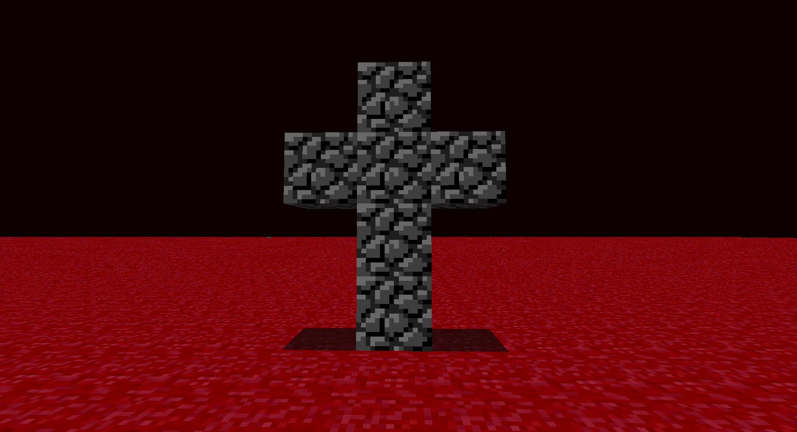

# RubyDung Horror Edition

A modified version of Minecraft's ancient prototype, RubyDung (rd-132211).

---

## Features

- Blood-red sky
- Red grass
- Fullscreen mode
- Mouse capture
- Java 8 support
- IntelliJ IDEA project setup

---

## Requirements

- Java 8
- IntelliJ IDEA
- LWJGL 2.9.4

---

## Getting Started

### 1. Install Java 8

Recommended download:

https://adoptium.net/temurin/releases/?version=8

---

### 2. Open the Project

Open the project root in IntelliJ IDEA.

---

### 3. Add LWJGL Libraries

Add these libraries to the project:

- lwjgl-2.9.4-nightly-20150209.jar
- lwjgl_util-2.9.4-nightly-20150209.jar

---

## Native DLL Setup

Extract DLLs from:

- lwjgl-platform-2.9.4-nightly-20150209-natives-windows.jar
- jinput-platform-2.0.5-natives-windows.jar

into:

C:\rubydung-natives

Add this VM option in IntelliJ:

-Djava.library.path=C:\rubydung-natives

---

## IntelliJ Run Configuration

### Main class

com.mojang.rubydung.RubyDung

### Working directory

$PROJECT_DIR$

### JRE

Java 8

---

## Controls

| Key | Action |
|---|---|
| WASD | Move |
| Mouse | Look around |
| Left Click | Place block |
| Right Click | Destroy block |
| ESC | Quit |

---

## Save File

World data is stored in:

level.dat

---

## Notes

RubyDung is an extremely old Minecraft prototype and uses LWJGL 2.

Some modern systems may experience compatibility issues.

---

## License

For educational and preservation purposes only.
